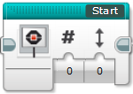
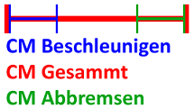

# **Blocksystem-OTTO-HAHN-ROBOTS** `v0.1`

_Bild von allen Bloecken_

- [Einfuehrung](#einfuehrung)
    - [Installation](#installation)
- [Bloecke](#bloecke)
    - [Start](#start)
    - [Fahren](#fahren)
    - [Drehen](#drehen)
    - [ZurueckgelegteDistanz](#zurueckgelegtedistanz)
    - [CminUmdrehungen](#cminumdrehungen)
    - [WartenAufDistanz](#wartenaufdistanz)
    - [GeschwindigkeitAendern](#geschwindigkeitaendern)
    - [AusrichtenLinie](#ausrichtenlinie)
    - [Linienverfolger](#linienverfolger)
- [Beispielprogramme](#beispielprogramme)
- [Roboterprofile](#roboterprofile)
    - [Datensaetze](#datensaetze)
- [Auswahlprogramm](#auswahlprogramm)

## Einfuehrung

### Installation
Um die Bloecke in seinem Projekt nutzen zu koennen muessen diese zuerst importiert werden. Dazu sollte als erstes der aktuelle Release des Blocksystems auf auf der Release-Seite auf Github heruntergeladen und entpackt werden. Anschließend wechselt man wieder zurueck auf die EV3-Software und oeffnet den Tab "Projekteigenschaften". Dort wechselt man auf den Tab "Eigene Bloecke" und drueckt ganz unten auf "Importieren". Daraufhin oeffnet sich ein Datei-Browser mit welchen man in sein eben entpacktes Verzeichnis hineinnavigiert und die Datei "Blocksystem_vX.X.X" (anstelle der X wird dort die Nummer des aktuellen Releases stehen). Anschließen drueckt man auf oeffnen und die Bloecke sind im EV3-Projekt vorhanden.

_Erklaer GIF/Video_

## Bloecke
Im Nachfolgenden werden die einzelnen Bloecke des Blocksystems mit ihren Funktion und ihrer Benutzung, bzw. ihren Parametern, vorgesetellt!

### Start 

Dieser Block muss am Anfang jeden Programmes gesetz werden, da hier alle Variablen, welche spaeter benoetigt werden, auf die entsprechendern Werte gesetz werden. Dies geschieht aufgrund der angegebenen Roboter id! Außerdem besteht die Moeglichkeit Einzusetellen, dass sich der Roboter durch langsames fahren am Anfang ausrichtet, was sich positiv auf die Genauigkeit beim Starten auswirkt. Anschließend werden alle Motoren zueuckgesetzt.

| Parameter | Wert | Beschreibung |
| - | - | - | 
| Roboter id | [Roboter id](#roboterprofile) | Durch die Roboter id wird der entsprechende Datensatz fuer einen Roboter gewaehlt, dieser wird dann in allen Bloecken des Blocksystems genutzt. Dazu muss der Datensatz eines Roboters im Blocksystem vorhanden sein. Eine Uebersicht dazu gibt es [hier](#roboterprofile)!
| Ausrichten | numerischer Wert (-1 - 1) | Um die Genauigkeit beim Starten zu erhoehen ist es empfehlenswert, dass der Roboter kurz vorwaerts/rueckwaerts gegen die Wand / den Starter faehrt, so sit sichergestellt, dasss der Roboter komplett gerade steht. Mit `-1` faehrt der Roboter kurz rueckwaerts, mit `1` kurz vorwaehrts. Bei `0` findet kein Ausrichten statt.

### Fahren

 Der Fahren-Block ist nur fuer einfachere, nicht so komplexe Fahrten (wie sie mit dem Block [GeschwindigkeitAendern](#geschwindigkeitaendern) moeglich sind) geeignet, da dieser Block durchgengig nur in eine Richtung faehrt, und die Richtung nicht waehrend der Fahrt geaendert werden kann. AUßerdem ist **dieser Block nicht dafuer ausgelegt auf der Stelle zu drehen**. Dennoch verfuegt der Fahren-Block ueber die Funktion langsam anzufahren und abzubremsen (_dies kann die Genauigkeit stark steigern_), wesshalb er fuer einfache Fahrten mit langsamen Anfahren/Abbremsen perfekt geeignet ist. _Sollten diese Funktion (langsam Anfahren/Abbremsen) nicht benoetigt werden wird emfohlen den Block [CmInUmdrehungen](#cminumdrehungen) in Kombination mit den Standard-EV3-Bloecken zu nutzen, da dies in diesem Falle zu einer besseren Praezision beitragen kann! _ **Auch dieser Block setzt die gefahren Umdrehungen nicht zurueck, die Distanz wird am inneren Motor der Kurve gemessen!**

 

| Parameter | Wert | Beschreibung |
| - | - | - |
| Richtung | numerischer Wert (-30 - 30) | Mit diesem Parameter wird festgelegt ob der Roboter gerade `0` faehrt oder eine Kurve fahren soll. Gibt man hier einen negativen Wert an wird eine Linkskurve gefahren, d.h. der linke Motor dreht langsamer (egal ob der Roboter vorwaerts oder rueckwaerts faehrt), gibt man einen positiven Wert an genau andersrum. |
| CM Beschleunigung | numerischer Wert (0 - ∞) | Hier wird die Distanz angegeben, die der Roboter brauchen soll, bis er die gewuenschte Geschwindigkeit erreicht hat. |
| Geschwindigkeit | numerischer Wert (-100 - 100) | Mit diesem Wert wird angegeben wie dschnell der Roboter Fahren soll. Bei negativen Werten faehrt der Roboter rueckwaerts, bei positiven vorwaerts. _Es ist sinnvoll diese Geschwindigkeit nicht auf das Maximum oder auf das Minimum, wo der Roboter gerade so faehrt, zu stellen, da diese Werte von Motor zu Motor stark variieren koennen, so dass der Roboter folglich sehr ungenau fahren kann._ |
| CM Gesammt | numerischer Wert (0 -∞) | Dieser Parameter kontrolliert die Distanz, die waehrend des kompletten Fahren-Blocks, inklusive Beschleunigungs- und Abbrems-Distanz, zurueckgelegt werden soll. Daher muss dieser Parameter mindestens genauso groß sein wie Beschleunigungs- und Abbrems-Distanz zusammen. |
| CM Abbremsen | numerischer Wert (0 - ∞) | Hier wird die Distanz angegeben, die der Roboter brauchen soll, von der Fahrtgeschwindigkeit bis zum Stehen abzubremsen |

### Drehen

### ZurueckgelegteDistanz

Dieser Block gibt aehnlich wie der Standart-EV3-Block "Motorumdrehung" aus, wie weit sich ein Motor **seit dem letzten zuruecksetzten** gedreht hat, im gegensatz zum Standart-EV3-Block gibt dieser Block jedoch die zurueckgelegte Distanz in cm aus, was die Programmierung deutlich erleichtern kann. 
| Parameter | Wert | Beschreibung |
| - | - | - |
| Motor | numerischer Wert (-1 / 1) | Wird hier `-1` angegbenen wird die zurueckgelegte Distanz am linken (B) Motor gemessen. Falls hier `1` angegeben wird am rechten (C) Motor. |

| Ausgabe | Wert | Beschreibung |
| - | - | - |
| Distanz in CM | numerischer Wert | Dieser Ausgabewert ist die zurueckgelgte Distanz in CM. Falls der Motor seit dem letzten Zuruecksetzen mehr rueckwaerts als vorwaerts gedreht wurde, ist dieser Wert negativ (falls der Motor umgekehrt eingebaut wurde, wird dies mit bruecksichtigt). Bei positiven Werten genau umgekehrt. | 

### CmInUmdrehungen

### WartenAufDistanz

Im gegensatz zum Block [ZurueckgelgteDistanz](#zurueckgelegtedistanz), der nur die zureuckgelgte Distanz ausgibt, wartet dieser Block darauf das eine gewisse Distanz erreicht wird und haelt das Programm so lange auf. Auch bei diesem Block wird die bis zum Start des Blockes zurueckgelgte **Distanz nicht zurueckgesetzt**, es gibt dennoch zwei verschiedene Modi. Bei einem der Modi wird die Distanz von beginn des Blockes gemessen (simuliert das die Distanz am Anfang des Blockes zurueckgesetz wird), beim zweiten Modi wird die insgesammte Distanz, also seit dem letzten zuruecksetzen breuecksichtigt. _Mit Nutzung des zuletzt erklaerten Modus, kann die Genauigkeit erheblich gesteigert werden!_

| Parameter | Wert | Beschreibung |
| - | - | - |
| Motor | numerischer Wert (-1 / 1) | Wird hier `-1` angegbenen wird die zurueckgelegte Distanz am linken (B) Motor gemessen. Falls hier `1` angegeben wird am rechten (C) Motor. |
| Distanz in CM | numerischer Wert | Hier wir die Distanz (in CM) angegeben auf die der Block warten soll. Dabei kann die Zahl positiv oder negativ angegeben werden, je nach dem ob auf negative oder positive werde gewartet weden soll. |
| Von Beginn des Blocks | logischer Wert | Hier kann ausgewaehlt werden ab welchem von welchem Punkt aus gemessen werden soll. Steht dieser Wert auf `Falsch` wird die Distanz seit dem letzen zuruecksetzen der Motorumdrehungen beruecksichtigt. Steht dieser Wert auf `Wahr` wird erst ab beginn des Blocks gemessen, die Motorenumdrehungen werden aber **nicht zurueckgesetzt**. |

### GeschwindigkeitAendern

Mit diesem Block ist es moeglich die Geschwindigkeiten der beiden Motoren (B und C) langsam zu veraendern. Dabei koennen die Motoren auch unterschiedlich schnell laufen, jedoch **nicht so, dass ein Motor vorwaerts dreht und der andere ruckwaerts** (so wuerde sich der Roboter auf der Stelle drehen). **Außerdem kann die Geschwindigkeit im Laufe der Beschleunigung nicht von einem positiven wert auf einen negativen Wert geaendert werden.** _Des weiteren ist es Empfehlenswert die Geschwindigkeiten so hoch oder so niedrig zu waehlen das die Differenzen der unterschiedlichen Motoren bei sehr niedriger oder sehr hoher Geschwindigkeit einen nicht so großen Einfluss auf die Genauigkeit des Roboters haben._ Durch ein langsames aendern der Geschwindigkeit steigt die Genauigkeit!

| Parameter | Wert | Beschreibung |
| - | - | - |
| Aktuelle Geschwindigkeit L | numerischer Wert (-100 - 100) | Hier wird die aktuelle Geschwindigkeit, bzw. die Geschwindigkeit ab der die Beschleunigung beginnen soll fuer den linken (B) Motor angegeben. **ACHTUNG: Der Wert muss so hoch sein, dass der Roboter sich vorwaerts bewegt (also auf keinen Fall `0`).** 
| Aktuelle Geschwindigkeit R | numerischer Wert (-100 - 100) | Der gleiche Parameter wie der zuvor erklaerte Parameter `Aktuelle Geschwindigkeit L`, nur fuer den rechten (C) Motor.
| CM | numerischer Wert (0 - ∞) | Dieser Parameter ist fuer die Strecke, die fuer die Beschleunigung / das Abbremsen gebraucht wird verantwortlich. Gemessen wird die Distanz vom Start des Blockes / der Geschwindigkeitsveraenderung bis zum Ende des Blockes / der Geschwindigkeitsveraenderung am Motor welcher in dieser Zeit weniger Strecke zuruecklegt (der Motor, der bei einer Kurve innen ist). **Die Motorumdrehungen werden dabei nicht zurueckgesetzt.**
| Neue Geschwindigkeit L | numerischer Wert (-100 - 100) | Hier wird die Geschwindigkeit angegeben, die nach der Beschleunigen / dem Abbremsen, nach der zuvor angegebenen Distanz mit dem linken (B) Motor erreicht sein soll. **ACHTUNG: Auch hier muss der Wert so hoch sein, dass der Roboter sich noch immer vorwaerts bewegt (alo auf keinen Fall `0`).** 
| Neue Geschwindigkeit R | numerischer Wert (-100 -100) | Der gleiche Parameter wie der zuvor erklaerte Parameter `Neue Geschwindigkeit L`, nur fuer den rechten (C) Motor.

### AusrichtenLinie

### Linienverfolger

## Beispielprogramme
_Beispielprogramme_

## Roboterprofile
| Roboter id | Roboter / Nutzen | Status |
| - | - | - |
| 0 | Rot-Schwarzer-Roboter (Gustav) | Noch nicht erstellt |
| 99 | Nur zum Entwickeln und Testen der Bloecke, **nicht Nutzen!** |  |

### Datensaetze
Damit das Blocksystem mit moeglichst allen Robotern funktioniert ist das komplette System variabel programmiert, so muessen nur bestimmte Variablen angepasst werden und das Blocksystem funktioniert auch mit diesem Roboter. Hinter jedem Roboter, welcher zunaechst ueber den "Roboter id"-Parameter des Start Blockes ausgewaehlt wird, steckt ein Datensatz welcher bestimmte EIgenschaften, bzw. Paramter fuer diesen Roboter festlegt. Soll ein neuer Roboter in das Blocksystem eingepflegt werden, muessen zunaechst alle untenstehenden Parameter festgelegt werdenu diese dann unter einer neune Roboter id in den Start Block des Blocksystem eingefuegt werden.

| Variable | Wert | Beschreibung |
| - | - | - |
| Alle_MotorenrichtungUmgekehrt | logischer Wert | Falls die Motoren umgekehrt eingebaut wurden, d.h. der Roboter rueckwaerts faehrt wenn die Motoren vorwaerts drehen, muss dieser Wert auf `Wahr` gesetzt werden |
| Start_AusrichtenGeschwindigkeit | numerischer Wert (0 - 100) | Falls beim Start Block Ausrichten ausgewaehlt wird, fahrt der Roboter langsam worwaerts, bzw. rueckwaerts um sich an der Wand auszurichten, so dass die Genauigkeit besser ist. Genau diese Geschwindigkeit wird durch diese Variable definiert
| Start_AusrichtenSekunden | numerischer Wert (0 - ∞) | Falls das Ausrichten beim Start Block, wie zuvor erklaert, ausgewaehlt wird, findet das Ausrichten fuer eine gewisse ANzahl von Sekunden statt, diese Dauer wird hier definiert |
| Start_AusrichtenSekundenWarten | numerischer Wert (0 - ∞) | Nach dem zuvor erklaerten Ausrichten wartet der Roboter eine gewisse Dauer damit die Motoren nicht direkt in die andere Richtung drehen (dies traegt zur Genauigkeit bei). Diese Dauer wird mit dieser Variable definiert |
| ZurueckgelgteDistanz_CmInGrad | numerischer Wert (0 - ∞) | Da das Blocksystem wegen der intuitieveren Benutzung mit Distanzen in CM arbeitet wird hier definiert, wie viel Grad ein Motor drehen muss, damit der Roboter einen Zentimeter zurueckgelegt hat|
|Fahren_StartGeschwindigkeit | numerischer Wert (0 - 100) | Wenn der Roboter mithilfe des Blocks [Fahren](#fahren) langsam anfahren soll, beginnen sich die Motoren anfangs mit dem hier angegeben Wert. Daher sollte dieser Wert so groß gewaehlt werden, dass beide Motoren sich zuverlaessig und glecihmaeßig drehen, aber auch nicht zu schnel, damit der Roboter noch moeglichst lange Beschleunigen kann |
| Fahren_AbbremsenProzentEndgeschwindigkeit | numerischer Wert (0 - 100) | Wenn der Roboter mithilfe des Fahren-Blocks am Ende langsam Abbremst wird das letze Stueck, nachdem der Roboter langsam abgebremst hat, konstant mit einer langsamen Geschwindigkeit absolviert bis die gewuenschte Distanz entgueltig erreicht wird. Dies traegt zur Genauigkeit bei, ohne dieses langsame Fahren am Ende ist ein genaues Stoppen garnicht moeglich! Mit diesem Parameter wird festgelgt wie viel Prozent der Strecke der Abbrems-Distanz dafuer verwendet wird, mit der Endgeschwindigkeit zu fahren.|
| Fahren_AbbremsenMaxDistanz Endgeschwindigkeit | numerischer Wert (0 - ∞) | Mit diesem Parameter wird kontrolliert was die maximale DIstanz ist, die mit der zuvor erlaeutertern ENdgeschwindigkeit gefahren wird. Solte die prozentual errechnete Strecke, welche mit dem zuvor erklaerten Parameter errechnet wird, groeßer sein als die hier angegebene Strecke, wird die prozentual errechnete Strecke nicht beachtet und die hier angegebene Stecke wird genutzt. |
| Fahren_Endgeschwindigkeit | numerischer Wert (0 - 100) | Mit diesem Parameter wird die End-Geschwindigkeit gesteuert, di am Ende des Abbremsens genutzt wird (wie in den beiden Parameter zuvor erklaert). Diese Geschwindigkeit sollte daher moeglichst gering gewaehlt werden, damit der Roboter moeglichst praezise anhalten kann. Sie sollte aber keinesfalls so niefrig gewaehlt werden, dass dei Motoren sehr ungenau oder ungleichmaeßig drehen. |

## Auswahlprogramm

_Das Auswahlprogramm wird erst zu einem spaeteren Zeitpunkt hinzugefuegt werden!_

