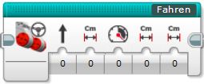
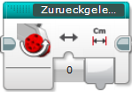

# **Blocksystem-OTTO-HAHN-ROBOTS** `v1.0.1`

- [Einführung](#einführung)
    - [Installation](#installation)
- [Blöcke](#blöcke)
    - [Start](#start)
    - [Fahren](#fahren)
    - [Drehen](#drehen)
    - [ZurueckgelegteDistanz](#zurueckgelegtedistanz)
    - [CminUmdrehungen](#cminumdrehungen)
    - [WartenAufDistanz](#wartenaufdistanz)
    - [GeschwindigkeitAendern](#geschwindigkeitaendern)
    - [AusrichtenLinie](#ausrichtenlinie)
    - [Linienverfolger](#linienverfolger)
- [Beispielprogramme](#beispielprogramme)
- [Roboterprofile](#roboterprofile)
    - [Datensätze](#datensätze)
- [Auswahlprogramm](#auswahlprogramm)

## Einführung
Dies ist das Blocksystem der OTTO-HAHN-ROBOTS zur Programmierung des EV3-Roboters für die First-Lego-League. Dieses Blocksystem fügt weitere (eigene) Blöcke zu EV3-Projekten hinzu, um die Programmierung zu erleichtern, den Zeitaufwand zu minimieren, die Genauigkeit des Roboters zu verbessern und um komplizierte Programmelememente für alle einfach nutzbar zu machen. Dabei sind diese Blöcke nicht komplett "neu", sondern lediglich schon "vorprogrammierte" Programmelemente, die nun einfach genutzt werden können. In dieser Dokumentation ist alles Wichtige zu finden, was benötigt wird um die Blöcke nutzen zu können. 

### Installation
Um die Blöcke in seinem Projekt nutzen zu können, müssen diese zuerst importiert werden. Dazu sollte als erstes der aktuelle Release des Blocksystems auf der Release-Seite auf GitHub heruntergeladen und entpackt werden. Anschließend wechselt man wieder zurückck auf die EV3-Software und öffnet den Tab "Projekteigenschaften". Dort wechselt man auf den Tab "Eigene Blöcke" und drückt ganz unten auf "Importieren". Daraufhin öffnet sich ein Datei-Browser, mit welchen man in sein eben entpacktes Verzeichnis hineinnavigiert und die Datei `Blocksystem_vX.X.X.ev3s`(anstelle der X wird dort die Nummer des aktuellen Releases stehen) öffnet. Anschließend drückt man auf öffnen und die Blöcke sind im EV3-Projekt vorhanden.

 Sind die Blöcke installiert, lässt sich ganz einfach prüfen, welche Version momentan im EV3-Projekt importiert ist. Dazu öffnet man einfach den [Start-Block](#start) und links neben dem Start-Symbol befindet sich eine Notiz, in welcher die Versionsnummer der momentan importierten Blocksystem-Version zu finden ist. Falls eine neuere Version vorhanden ist befolgt man die bereits oben beschriebenen erneut (nun mit der neuen Version, die wieder zuerst heruntergeladen werden muss). Bevor man die Blöcke jedoch importiert, müssen die Blöcke der alten Version zunächst gelöscht werden, dies ist auch direkt im Menü möglich wo man auch auf "importieren" drückt. Da beim installieren einer neueren Version des Blocksystems immerauch mal etwas falsch laufen kann, oder das Pogramm nach dem importieren der "neuen" Blöcke nicht mehr funktioniert, da an den Blöcken etwas geändert wurde, sollte umbedingt zunächst eine Sicherheitskopie des Programmes abgespeichert werden (dies ist zwischendurch sowieso empfehlenswert)!

## Blöcke
Im Nachfolgenden werden die einzelnen Blöcke des Blocksystems mit ihren Funktionen und ihrer Benutzung, bzw. ihren Parametern, vorgesetellt!

### Start 

Dieser Block muss am Anfang jeden Programmes, in dem die Blöcke des Blocksystems genutzt werden, gesetzt werden, da hier alle Variablen, welche später benötigt werden, auf die entsprechenden Werte gesetzt werden. Dies geschieht aufgrund der angegebenen [Roboter id](#roboterprofile)! Außerdem besteht die Möglichkeit einzustellen, dass sich der Roboter durch langsames fahren gegen die Bande am Anfang ausrichtet, was sich positiv auf die Genauigkeit beim Starten auswirkt. Anschließend werden alle Motoren zurückgesetzt.

| Parameter | Wert | Beschreibung |
| - | - | - | 
| Roboter id | [Roboter id](#roboterprofile) | Durch die Roboter id wird der entsprechende Datensatz für einen Roboter gewählt, dieser wird dann in allen Blöcken des Blocksystems genutzt. Dazu muss der Datensatz eines Roboters im Blocksystem vorhanden sein. Eine Uebersicht dazu gibt es [hier](#roboterprofile)!
| Ausrichten | numerischer Wert (-1 - 1) | Um die Genauigkeit beim Starten zu erhöhen ist es empfehlenswert, dass der Roboter kurz vorwärts/rückwärts gegen die Wand / den Starter fährt. So ist sichergestellt, dass der Roboter komplett gerade steht. Mit `-1` fährt der Roboter kurz rückwärts, mit `1` kurz vorwärts. Bei `0` findet kein Ausrichten statt.

### Fahren

 Der Fahren-Block ist nur für einfachere, nicht so komplexe Fahrten (wie sie mit dem Block [GeschwindigkeitAendern](#geschwindigkeitaendern) möglich sind) geeignet, da dieser Block durchgängig nur in eine Richtung/gleichbleibender Kurvenradius fährt, und die Richtung nicht während der Fahrt geändert werden kann. Außerdem ist **dieser Block nicht dafür ausgelegt auf der Stelle zu drehen**. Dennoch verfügt der Fahren-Block über die Funktion langsam anzufahren und abzubremsen (_dies kann die Genauigkeit stark steigern_), wesshalb er für einfache Fahrten mit langsamen Anfahren/Abbremsen perfekt geeignet ist. _Sollten diese Funktion (langsam Anfahren/Abbremsen) nicht benötigt werden, ist es auch möglich den Block [CmInUmdrehungen](#cminumdrehungen) in Kombination mit den Standard-EV3-Blöcken zu nutzen, da dieser Block / diese Blöcke wesentlich einfacher aufgebaut sind!_ **Auch dieser Block setzt die gefahren Umdrehungen nicht zurück, die Distanz wird am inneren Motor der Kurve gemessen!**

 

| Parameter | Wert | Beschreibung |
| - | - | - |
| Richtung | numerischer Wert (-30 - 30) | Mit diesem Parameter wird festgelegt ob der Roboter gerade (`0`) fährt oder eine Kurve fahren soll. Gibt man hier einen negativen Wert an wird eine Linkskurve gefahren, d.h. der linke Motor dreht langsamer (egal ob der Roboter vorwärts oder rückwärts fährt), gibt man einen positiven Wert an genau andersrum. |
| CM Beschleunigung | numerischer Wert (0 - ∞) | Hier wird die Distanz angegeben, die der Roboter brauchen soll, bis er die gewünschte Geschwindigkeit erreicht hat. |
| Geschwindigkeit | numerischer Wert (-100 - 100) | Mit diesem Wert wird angegeben wie schnell der Roboter Fahren soll. Bei negativen Werten fährt der Roboter rückwärts, bei positiven vorwärts. _Es ist sinnvoll diese Geschwindigkeit nicht auf das Maximum oder auf das Minimum, wo der Roboter gerade so fährt, zu stellen, da diese Werte von Motor zu Motor stark variieren können, so dass der Roboter folglich sehr ungenau fahren kann._ |
| CM Gesammt | numerischer Wert (>0 -∞) | Dieser Parameter kontrolliert die Distanz, die während des kompletten Fahren-Blocks, inklusive Beschleunigungs- und Abbrems-Distanz, zurückgelegt werden soll. Daher muss dieser Parameter mindestens genauso groß sein wie Beschleunigungs- und Abbrems-Distanz zusammen. |
| CM Abbremsen | numerischer Wert (0 - ∞) | Hier wird die Distanz angegeben, die der Roboter brauchen soll, von der Fahrgeschwindigkeit bis zum Stehen abzubremsen. |

### Drehen

Dieser Block ermöglicht es, dass sich der Roboter entweder auf der Stelle mit beiden Motoren, oder nur mit einem der Motoren dreht. Dabei ist es auch möglich, dass die Motoren langsam beschleunigen und auch langsam wieder abbremsen, *was die Genauigkeit erhöhen kann*. **ACHTUNG: Im Gegensatz zu den meisten anderen Blöcken, setzt dieser Block die Motorumdrehungen am Anfang und am Ende zurück!!!**

| Parameter | Wert | Beschreibung |
| - | - | - |
| Linker Motor | numerischer Wert (-1 - 1) | Mit diesem Parameter wird eingestellt in welche Richtung der Roboter, bzw. der linke Motor drehen soll: Gibt man hier `-1` an, dreht der Linke Motor rückwärts, bei `1` vorwärts und bei `0` bleibt er stehen. |
| Rechter Motor | numerischer Wert (-1 - 1) | Mit diesem Parameter wird, wie auch schon beim Parameter zuvor, die Richtung bestimmt, in die der rechte Motor drehen soll. |
| Grad Beschleunigen (Winkel) | numerischer Wert (0 - ∞) | Hier wird angegeben wie viel Grad der Roboter sich drehen soll bis er die gewünschte Geschwindigkeit erreicht hat. Wird hier `0` angegeben startet der Roboter sofort mit der angegebenen Geschwindigkeit und beschleunigt nicht langsam. |
| Geschwindigkeit | numerischer Wert (>0 - 100) | Durch diesen Parameter wird kontrolliert wie schnell der Roboter sich drehen soll. Wenn sich nur einer der Motoren dreht, dreht der Roboter dementsprechend halb so schnell, als wenn sich beide Motoren drehen. |
| Grad Abbremsen (Winkel) | numerischer Wert (0 - ∞) | Wenn der Roboter langsam abbremsen soll, kann hier der Winkel angegeben werden, den es dauern soll bis der Roboter von der eingestellten Geschwindigkeit vollständig abgebremst hat. Wird hier `0` angegeben bremst der Roboter nicht langsam ab, sondern bleibt sofort stehen. |
| Winkel Drehen | numerischer Wert (>0 - ∞) | Hier wird angegeben um wie viel Grad sich der Roboter insgesamt drehen soll. Dieser Winkel muss dabei mindest so groß sein wie der Winkel zur Beschleunigung und das Abbremsen zusammen. |

### ZurueckgelegteDistanz

Dieser Block gibt ähnlich wie der Standard-EV3-Block "Motorumdrehung" aus, wie weit sich ein Motor **seit dem letzten zurücksetzten** gedreht hat, im gegensatz zum Standard-EV3-Block gibt dieser Block jedoch die zurückgelegte Distanz in CM aus, was die Programmierung deutlich erleichtern kann. 

| Parameter | Wert | Beschreibung |
| - | - | - |
| Motor | numerischer Wert (-1 / 1) | Wird hier `-1` angegben wird die zurückgelegte Distanz am linken (B) Motor gemessen. Falls hier `1` angegeben wird am rechten (C) Motor. |

| Ausgabe | Wert | Beschreibung |
| - | - | - |
| Distanz in CM | numerischer Wert | Dieser Ausgabewert ist die zurückgelgte Distanz in CM. Falls der Motor seit dem letzten Zurücksetzen mehr rückwärts als vorwärts gedreht wurde, ist dieser Wert negativ (falls der Motor umgekehrt eingebaut wurde, wird dies mit berücksichtigt). Bei positiven Werten genau umgekehrt. | 

### CmInUmdrehungen

Mit diesem Block ist es möglich eine Distanz von Zentimeter in Umdrehungen für den benutzen Roboter zu errechnen. Dies geschieht aufgrund der [Roboter id](#roboterprofile), welche am Start des Programmes als Parameter des [Start-Block](#start) angegeben wird, bzw. aufgrund der hinterlegten Daten. So ist es mithilfe von diesem Block möglich auch mit Standard-EV3 Blöcken mit Cm-Angaben zu programmieren!

| Parameter | Wert | Beschreibung |
| - | - | - |
| CM | numerischer Wert | Die Distanz in Cm die in Umdrehungen umgewandelt werden soll. | 

| Ausgabe | Wert | Beschreibung |
| - | - | - |
| Umdrehungen | numerischer Wert | Dieser Wert, der vom Block ausgegeben wird, ist die Anzahl der Umdrehungen, die aus der CM-Zahl errechnet wurde. |

### WartenAufDistanz

Im Gegensatz zum Block [ZurueckgelgteDistanz](#zurueckgelegtedistanz), der nur die zureuckgelgte Distanz ausgibt, wartet dieser Block darauf das eine gewisse Distanz erreicht wird und hält das Programm so lange auf. Auch bei diesem Block wird die bis zum Start des Blockes zurückgelgte **Distanz nicht zurückgesetzt**, es gibt dennoch zwei verschiedene Modi. Bei einem der Modi wird die Distanz von Beginn des Blockes gemessen (simuliert das die Distanz am Anfang des Blockes zurückgesetz wird, wird sie jedoch in echt nicht), beim zweiten Modi wird die insgesammte Distanz, also seit dem letzten zurücksetzen berücksichtigt. _Mit Nutzung des zuletzt erklärten Modus, kann die Genauigkeit gesteigert werden, da so verherige ungenauigkeiten evtl. korrigiert werden können und sich die Fehler soo nicht immer weiter auf addieren!_

| Parameter | Wert | Beschreibung |
| - | - | - |
| Motor | numerischer Wert (-1 / 1) | Wird hier `-1` angegben wird die zurückgelegte Distanz am linken (B) Motor gemessen. Falls hier `1` angegeben wird am rechten (C) Motor. |
| Distanz in CM | numerischer Wert | Hier wir die Distanz (in CM) angegeben auf die der Block warten soll. Dabei kann die Zahl positiv oder negativ angegeben werden, jenachdem ob auf negative oder positive werde gewartet werden soll. |
| Von Beginn des Blocks | logischer Wert | Hier kann ausgewählt werden ab welchem der Punkt gemessen werden soll. Steht dieser Wert auf `Falsch` wird die Distanz seit dem letzen zurücksetzen der Motorumdrehungen berücksichtigt. Steht dieser Wert auf `Wahr` wird erst ab Beginn des Blocks gemessen, die Motorenumdrehungen werden aber **nicht zurückgesetzt**. |

### GeschwindigkeitAendern

Mit diesem Block ist es möglich die Geschwindigkeiten der beiden Motoren (B und C) langsam zu verändern. Dabei können die Motoren auch unterschiedlich schnell laufen, jedoch **nicht so, dass ein Motor vorwärts dreht und der andere ruckwärts** (so würde sich der Roboter auf der Stelle drehen). **Außerdem kann die Geschwindigkeit im Laufe der Beschleunigung nicht von einem positiven wert auf einen negativen Wert geändert werden.** _Des Weiteren ist es Empfehlenswert die Geschwindigkeiten so hoch oder so niedrig zu wählen das die beiden Motoren starke abweichungen abweisen, was bei sehr geringen oder hohen Geschwindigkeiten der Fall ist._ Durch ein langsames ändern der Geschwindigkeit steigt die Genauigkeit!

| Parameter | Wert | Beschreibung |
| - | - | - |
| Aktuelle Geschwindigkeit L | numerischer Wert (-100 - 100) | Hier wird die aktuelle Geschwindigkeit, bzw. die Geschwindigkeit, ab der die Beschleunigung beginnen soll für den linken (B) Motor angegeben. **ACHTUNG: Der Wert muss so hoch sein, dass der Roboter sich vorwärts bewegt (also auf keinen Fall `0`).** 
| Aktuelle Geschwindigkeit R | numerischer Wert (-100 - 100) | Der gleiche Parameter wie der zuvor erklärte Parameter Aktuelle Geschwindigkeit L, nur für den rechten (C) Motor.
| CM | numerischer Wert (0 - ∞) | Dieser Parameter ist für die Strecke, die für die Beschleunigung / das Abbremsen gebraucht wird verantwortlich. Gemessen wird die Distanz vom Start des Blockes / der Geschwindigkeitsveränderung bis zum Ende des Blockes / der Geschwindigkeitsveränderung (immer positiv) am Motor, welcher in dieser Zeit weniger Strecke zurücklegt (der Motor, der bei einer Kurve innen ist). **Die Motorumdrehungen werden dabei nicht zurückgesetzt.**
| Neue Geschwindigkeit L | numerischer Wert (-100 - 100) | Hier wird die Geschwindigkeit angegeben, die nach der Beschleunigen / dem Abbremsen, nach der zuvor angegebenen Distanz mit dem linken (B) Motor erreicht sein soll. **ACHTUNG: Auch hier muss der Wert so hoch sein, dass der Roboter sich noch immer vorwärts bewegt (also auf keinen Fall `0`).** 
| Neue Geschwindigkeit R | numerischer Wert (-100 -100) | Der gleiche Parameter wie der zuvor erklärte Parameter Neue Geschwindigkeit L, nur für den rechten (C) Motor.

### AusrichtenLinie
_Noch nicht hinzugefügt!_

### Linienverfolger
_Noch nicht hinzugefügt!_

## Beispielprogramme
_Beispielprogramme noch nicht hinzugefügt!_

## Roboterprofile
| Roboter id | Roboter / Nutzen | Status |
| - | - | - |
| 0 | Rot-Schwarzer-Roboter (Gustav) | In Benutzung! |
| 99 | Nur zum Entwickeln und Testen der Blöcke, **nicht Nutzen!** | - |

### Datensätze
Damit das Blocksystem mit möglichst allen Robotern funktioniert ist das komplette System variabel programmiert, so müssen nur bestimmte Variablen angepasst werden und das Blocksystem funktioniert mit jedem Roboter. Hinter jedem Roboter, welcher zunächst über den "Roboter id"-Parameter des Start Blockes ausgewählt wird, steckt ein Datensatz welcher bestimmte Eigenschaften, bzw. Parameter für diesen Roboter festlegt. Soll ein neuer Roboter in das Blocksystem eingepflegt werden, müssen zunächst alle untenstehenden Parameter festgelegt werden und diese dann unter einer neuen Roboter id in den Start Block des Blocksystem eingefügt werden.

| Variable | Wert | Beschreibung |
| - | - | - |
| Alle_MotorenrichtungUmgekehrt | logischer Wert | Falls die Motoren umgekehrt eingebaut wurden, d.h. der Roboter rückwärts fährt wenn die Motoren vorwärts drehen, muss dieser Wert auf `Wahr` gesetzt werden. |
| [Start](#start)_AusrichtenGeschwindigkeit | numerischer Wert (>0 - 100) | Falls beim Start Block Ausrichten ausgewählt wird, fährt der Roboter langsam vorwärts, bzw. rückwärts um sich an der Wand auszurichten, so dass die Genauigkeit besser ist. Genau diese Geschwindigkeit wird durch diese Variable definiert. |
| [Start](#start)_AusrichtenSekunden | numerischer Wert (>0 - ∞) | Falls das Ausrichten beim Start Block, wie zuvor erklärt, ausgewählt wird, findet das Ausrichten für eine gewisse Anzahl von Sekunden statt, diese Dauer wird hier definiert. |
| [Start](#start)_AusrichtenSekundenWarten | numerischer Wert (0 - ∞) | Nach dem zuvor erklärten Ausrichten wartet der Roboter eine gewisse Dauer damit die Motoren nicht direkt in die andere Richtung drehen (dies trägt zur Genauigkeit bei). Diese Dauer wird mit dieser Variable definiert. |
| [ZurueckgelegteDistanz](#zurueckgelegtedistanz)_CmInGrad | numerischer Wert (>0 - ∞) | Da das Blocksystem wegen der intuitiveren Benutzung mit Distanzen in CM arbeitet wird hier definiert, wie viel Grad ein Motor drehen muss, damit der Roboter einen Zentimeter zurückgelegt hat. |
| [Fahren](#fahren)_StartGeschwindigkeit | numerischer Wert (>0 - 100) | Wenn der Roboter mithilfe des Blocks [Fahren](#fahren) langsam anfahren soll, beginnen sich die Motoren anfangs mit dem hier angegeben Wert. Daher sollte dieser Wert so groß gewählt werden, dass beide Motoren sich zuverlässig und gleichmäßig drehen, aber auch nicht zu schnell, damit der Roboter noch möglichst lange beschleunigen kann. |
| [Fahren](#fahren)_AbbremsenProzentEndgeschwindigkeit | numerischer Wert (0 - 100) | Wenn der Roboter mithilfe des Fahren-Blocks am Ende langsam abbremst wird das letzte Stück, nachdem der Roboter langsam abgebremst hat, konstant mit einer langsamen Geschwindigkeit absolviert bis die gewünschte Distanz entgültig erreicht wird. Dies trägt zur Genauigkeit bei, ohne dieses langsame Fahren am Ende ist ein genaues Stoppen gar nicht möglich! Mit diesem Parameter wird festgelgt wie viel Prozent der Strecke der Abbrems-Distanz dafür verwendet wird, mit der Endgeschwindigkeit zu fahren.|
| [Fahren](#fahren)_AbbremsenMaxDistanz Endgeschwindigkeit | numerischer Wert (0 - ∞) | Mit diesem Parameter wird kontrolliert, was die maximale Distanz ist, die mit der zuvor erläutertern Endgeschwindigkeit gefahren wird. Sollte die prozentual errechnete Strecke, welche mit dem zuvor erklärten Parameter errechnet wird, größer sein als die hier angegebene Strecke, wird die prozentual errechnete Strecke nicht beachtet und die hier angegebene Strecke wird genutzt. |
| [Fahren](#fahren)_EndGeschwindigkeit | numerischer Wert (>0 - 100) | Mit diesem Parameter wird die End-Geschwindigkeit gesteuert, die am Ende des Abbremsens genutzt wird (wie in den beiden Parameter zuvor erklärt). Diese Geschwindigkeit sollte daher möglichst gering gewählt werden, damit der Roboter möglichst präzise anhalten kann. Sie sollte aber keinesfalls so niedrig gewählt werden, dass die Motoren sehr ungenau oder ungleichmäßig drehen. |
| [Drehen](#drehen)_StartGeschwindigkeit | numerischer Wert (>0 - 100) | Mit diesem Parameter wird eingestellt mit welcher Geschwindigkeit der Roboter beim [Drehen Block](#drehen) anfahren soll. Der Wert sollte so gering wie möglich gewählt werden, damit das Anfahren möglichst genau ist, aber auch nicht so gering, dass die Motoren sehr ungenau oder ungleichmäßig drehen. |
| [Drehen](#drehen)_GradFür360Drehung | numerischer Wert (>0 - ∞) | Hier wird angegeben wie viel Grad sich ein Motor drehen muss, bis sich der Roboter um 360 Grad gedreht hat, wenn sich beide Motoren gleichzeitig drehen. |
| [Drehen](#drehen)_AbbremsenProzentEndgeschwindigkeit | numerischer Wert (0 - 100) | Mit diesem Wert wird eingestellt wie viel Prozent der Strecke des Abbremsens mit der eingestellten Endgeschwindigkeit zurückgelegt werden soll. |
| [Drehen](#drehen)_MaxWinkelEndgeschwindigkeit | numerischer Wert (0 - ∞) | Hier wird angegeben wie viel Grad (Winkel) maximal mit der Endgeschwindigkeit zurückgelegt werden sollen. Ist der Winkel, der durch den zuvor angegebenen Prozentsatz errechnet wird größer als dieser Wert, wird dieser Wert genutzt. |
| [Drehen](#drehen)_Endgeschwindigkeit | numerischer Wert (>0 - 100) | Mit diesem Parameter wird eingestellt mit welcher Geschwindigkeit der Motor/die Motoren am Ende des Abbremsens drehen, bis der richtige Winkel erreicht ist. |
| [Drehen](#drehen)_SchwelleMotorKorrektion | numerischer Wert (>0 - ∞) | Drehen beim Drehen Block beide Motoren wird nur an einem der Motoren aktiv gemessen und der andere Motor läuft jeweils mit derselben Geschwindigkeit (in die andere Richtung) einfach mit. Da die Motoren jedoch leicht unterschiedlich drehen können kann es so zu Ungenauigkeiten kommen. Um diesem entgegenzuwirken werden auch die Motorumdrehungen des anderen Motors gemessen und mit denen des "richtigen" Motors verglichen. Sollten die Motorenstände um eine gewisse Gradzahl, die mit diesem Parameter eingestellt wird, unterschiedlich sein wird gegengesteuert. |
|[Drehen](#drehen)_GeschwindigkeitMotorKorrektion | numerischer Wert (0 - 100) | Sollte die in dem zuvor erläuterte Schwelle überschritten werden wird der entsprechende Motor um eine gewisse Geschwindigkeit verschnellert oder verlangsamt. Diese Geschwindigkeit kann hier eingestellt werden. |

## Auswahlprogramm

_Das Auswahlprogramm wird erst zu einem späteren Zeitpunkt hinzugefügt werden!_

